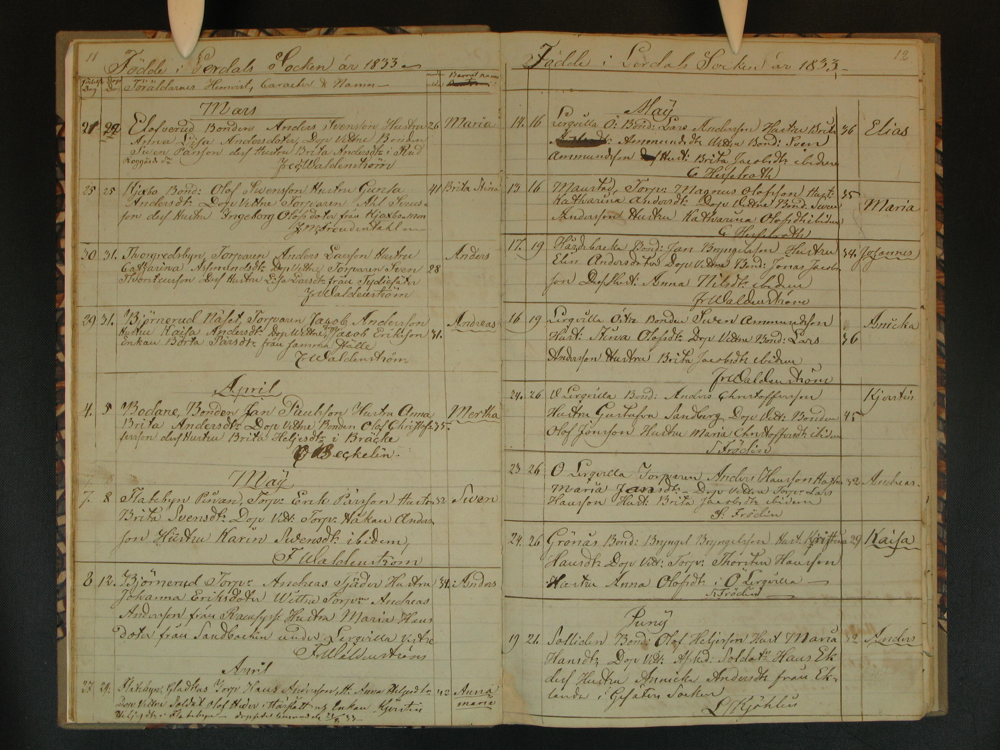
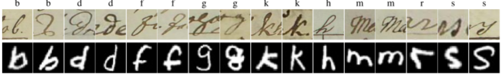

## CArDIS: A Swedish Historical Handwritten Character Dataset with 101,500 characters

CArDIS dataset, the collection of Swedish historical documents were acquired from Arkiv Digital Company’s document image dataset which has more
than 88 million images created from Swedish Church, census, court records and
other historical documents  and these documents were penned between 1800 to
1900 by various anonymous priests in different counties. From which, 64,084
sample Swedish historical handwritten character images were selected to
create the dataset. Each sample of Swedish birth record handwritten document
image has information about a newly born child’s name, born date, baptized date,
born place, father’s name, and mother’s name.
Using the above 64,084 samples of Swedish historical handwritten character document images, 101,500 characters have been cropped to generate CArDIS dataset were each character has 3500 samples. This dataset has multiple unique characteristics explained below:

•	Degradation: The age of the documents, quality of the paper and ink used
play an important role in degradation of the characters in CArDIS
dataset. Since, the documents were penned in 19th century by various priests
using ink pen on old brown papers, the letters in the dataset are
deteriorated and fainted. Additionally, there are multiple disturbances in the
data like variation of the background, show-through, weak text stroke, merged
characters and bleed-through.

•	Handwriting Styles: Every individual is different from another and unique
in their own way same like every individual will possess his/her own handwriting
style. Considering this fact, the handwriting style, the way of holding pen
with different pressure, their choice of choosing materials like using ink dips
and ball pens result in distinct writing styles, shapes, sizes, orientations and
directions. Ultimately, leading to a endless inter-class variations and new font.

•	Presence of Special characters: Since, the documents are written in
Swedish language, there are special characters (å, ä, ö) other than standard Latin
alphabets causing intra and inter class variations.
However, the above characteristics become dominant over the existing handwritten
datasets overcoming the restrictions over existing datasets. Thus, CArDIS
dataset form a new type of dataset with new and unique characteristics.

This collection of dataset consists of isolated handwritten Latin
characters and special Swedish characters. Latin characters consists of alphabets a
to z where as Swedish special characters consists of alphabets, å,ä,ö.Note that all
the characters collected are lowercase letters only and also each and every character
have been cropped manually from 64, 084 historical Swedish birth record handwritten
document images. This particular dataset contains 29 classes in which 26 classes
represent a to z and the other 3 classes represent å, ä, ö. Each class has 3500 images
which in total will be 101,500 lowercase letter images(3500*29).Since, there is
no historical handwritten Swedish lowercase letters dataset that provides more than
1,00,000 image samples in RGB color space available till date, this point stands as
a motive behind generating this huge dataset. This eventually paves path to further
researchers who would continue their research in handwritten lowercase letter recognition systems in Swedish as well as English while promoting segmentation for OCR systems in historical document images.
(a). This dataset is in contrast with the existing publicly available handwritten digit datasets (e.g. EMNIST (b))

(a)

(b)

[Character dataset 101,500](https://drive.google.com/drive/folders/11hkBQ3ampwL3pXLoz8oQBwt8GoLba3DP)

If you use any of these datasets, please cite:

**Reference:**

•	Amir Yavariabdi, Huseyin Kusetogullari, Turgay Celik, Sakib Rijwan, Shivani Thummanapally, Johan Hall, “CArDIS: A Swedish Historical Handwritten Character Dataset”, IEEE Access (under review).

•	Amir Yavariabdi, Huseyin Kusetogullari, Turgay Celik, Sakib Rijwan, Shivani Thummanapally, Johan Hall, CArDIS: A Swedish Historical Handwritten Dataset with 101.500 Characters, February 2022. Accessed on: February 06, 2022. Available: []https://cardisdataset.github.io/CARDIS/.

**BibTeX:**

•	@article{CARDIS2022,
title={CArDIS: A Swedish Historical Handwritten Character Dataset,
author={Amir Yavariabdi, Huseyin Kusetogullari, Turgay Celik, Sakib Rijwan, Shivani Thummanapally, Johan Hall},
journal={IEEE Access},
year={2022}
}

•	@misc{CARDIS2022,
author = {Amir Yavariabdi, Huseyin Kusetogullari, Turgay Celik, Sakib Rijwan, Shivani Thummanapally, Johan Hall},
title = {CArDIS: A Swedish Historical Handwritten Character Dataset with 101.500 Characters},
howpublished = {\url{https://cardisdataset.github.io/CARDIS/}},
note = {Accessed: 2022-02-06}
}
